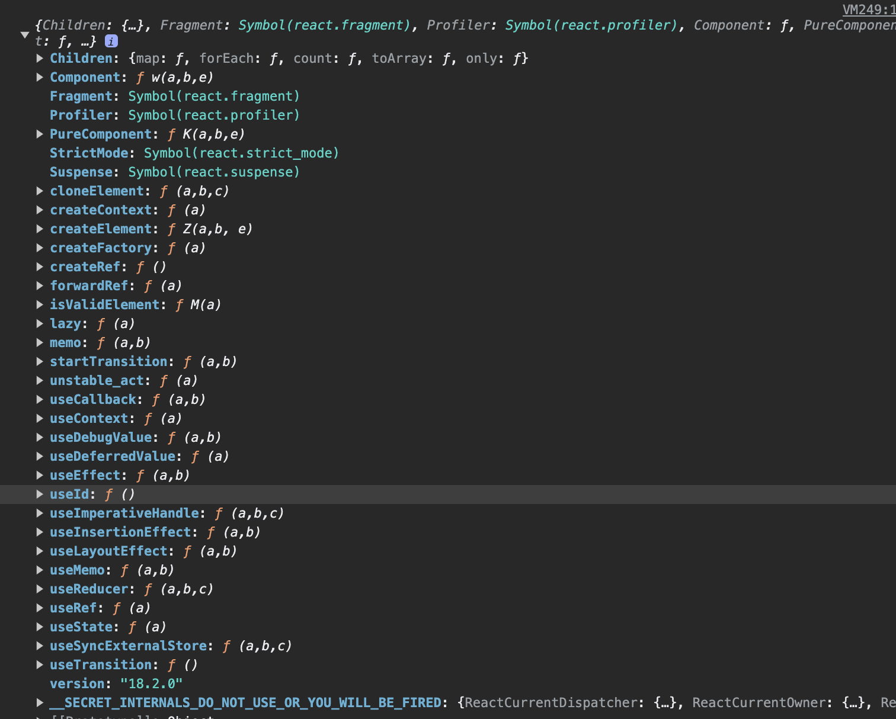
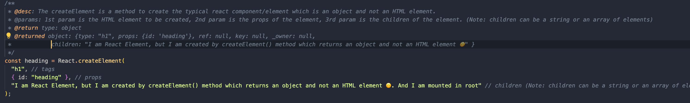
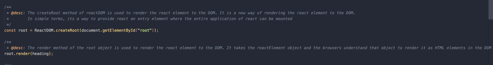

# Let's learn together **React**

**(Please Readme)** : The document might be looking very long and with a lot of info to read but trust me when you start reading it you will enjoy it because you will be able to relate each and every word which you always feel while developing, i.e curious, confused and with a lot questions. Also I have tried to frame it in a very funny way because I believe that whatever we do we should do it with having a lot fun.

## Lesson 1 (Vanilla React 🤔 🤨 🧐 😳 😭 🥲)

As you can see when we hear Vanilla React we all get the same emotion out and we think what the heck is vanilla React, right? So here vanilla react is just React which we use but here we are more focused on using React API methods rather than JSX approach. The name `Vanilla React` is not universally used but I gave it a name since it can be easily used with vanilla JS as simple as that 😬. Also I have done a lot of talking lets jump into it.

## We can use react directly in our typical old school web application which uses HTML, CSS and JS approach 😳 😨

Hmm, sounds interesting right? But how can we use it 🤨 ? <br />
Introducing (Drumrolls sound...... 🥁 🥁 🥁 🥁) **REACT CDN** ❤️ 🥶 <br />

<br />

- Development mode React JS lib (More developer friendly, readable, and easy for debug all the react modules and functionality)

```JS
<script crossorigin src="https://unpkg.com/react@18/umd/react.development.js"></script>
<script crossorigin src="https://unpkg.com/react-dom@18/umd/react-dom.development.js"></script>
```

- Production mode React JS lib (Minified code that is not developer friendly as it focused on decreasing in file size, code efficiency)

```JS
<script crossorigin src="https://unpkg.com/react@18/umd/react.production.min.js"></script>
<script crossorigin src="https://unpkg.com/react-dom@18/umd/react-dom.production.min.js"></script>
```

All the JS experts will be very familiar about the this script tag and attributes but for more info and learning lets all together explore about the `crossorigin` attribute and other script attribute as well like `defer` and `async`

- `crossorigin`: Heard about this term earlier right? Yes you are absolutely right you might have heard or seen similar type of terminology in the HTTP request and its similar to that itself. Lets elaborate more on it. <br />
  `The crossorigin attribute sets the mode of the request to an HTTP CORS Request. Web pages often make requests to load resources on other servers. Here is where CORS comes in. A cross-origin request is a request for a resource (e.g. style sheets, iframes, images, fonts, or scripts) from another domain.` <br />

  Note: crossorigin doesn't help with any parallel execution of the script it downloads and executes in sync process and during the entire process it halts the HTML parsing since it runs in sync

- `async`: Hmm every JS developer will be familiar with this term `async` and yes its does the same type of behaviour when we attach `async` in the `script` tag. When `async` is attached in the `script` tag it download the resources in parallel while the HTML DOM is parsing but when the resources are downloaded it takes up the executing in sync i.e it blocks the HTML DOM parsing until the execution time. <br />

As you can see it behaves similar to the Promise i.e the code runs async until the promise is resolved and once the promise is resolved it executes that .then block (Its not exactly the Promise approach but something similar to it)

- `defer`: Very interesting and most helpful attribute for `script` tag. When `defer` is defined as attribute every thing runs in parallel without blocking the HTML parsing. So first the resources will be downloaded parallel while the HTML DOM is being parsed and once the HTML DOM is parsed then the resources are executed in sync, so in this approach the HTML DOM is never blocked in parsing and it provides very good performance. The reason the execution doesn't take place in parallel is because of the single thread.

**When to use which attribute**

- defer: Use it for most of script as it give better performance
- async: Use for external addons script of the web app like for e.g Google ad links or some similar use cases

## Break ☕️ 🥱 🤯

```
Fewww... alot of info to capture, lets take a break and comeback again also we have an Oops movement as we lost our track of vanilla JS but nothing to worry as everything will be covered ahead
```

## Let't jump into how does Vanilla React looks like (Excited 😁 ?)

So before we jump in directly lets see how the React objects look. I know many of us have been using react in our day to day life but we mostly don't get much motivation or reasons to explore the React object because we are always busy with our feature development with some extra realistic deadlines 😛 but nothing to worry let's explore it together. <br />

Since react will be available in the execution context we can console and explore its property just by using `console.log(React)`

Let's see what do we get in it, please refer to the below image



As you can see in the above image, it contains all the hooks, methods, prototypes chains and some unique identifier derived from the `Symbol` data type of JS. <br />

The object which we see above is all react which is more than enough to create complex web application, isn't its interesting 🤯 ? Its fascinating for me since its very small in size comparable to other library and frameworks and its just a cdn import and that's all

We'll all look at the different property later but for now lets explore how we can create HTML elements using `React` object because that's the motivation for todays experiment.

**✅ React.createElement ✅**

I believe that in our school days, we have majorly used the WebAPIs in our javascript files for DOM manipulation and for some click events like `getDocumentById`, `querySelector` and many such similar APIs like them, right? So Vanilla React is also something similar to it. Here instead of using `document` object we will be using `React` object i.e `React.createElement`,

Let's understand the definition of `React.createElement` method

```JS

/**
 * tagType: "h1" | "div" | any HTML tag which is passed as string
 * props: props are property or attributes which we are willing to provide to the tag i.e {id: 'id1', data-attribute: '1'}
 * children: children can be string or react element object
 * returns: React element object
*/
React.createElement(tagType, props, children)

```

If you read the above code snippet perfectly, you might have observed that I have written that `createElement` will return a React element object 😳. Now what the heck is React element object, by looking at the method its was little bit self explainary that it would have return back an HTML element but no it returns react element object. Please refer the below image for an example of `React.createElement`



**ReactDOM.createRoot**

This is the most important method in react and this is very the entire stuff of react start from. The createRoot method creates the root of the application by referring to a div in the actual DOM tree and then mounts the entire application tree into it. The reason here we are using ReactDOM because if we know react uses virtual DOM mechanism, so it mounts the entire application into the virtual DOM tree as well and then it optimizes the DOM manipulation.

Please refer the below image for reference



Here as you can see we create root and then passed the children into it. So now it will mount the entire application into the actual DOM and in the virtual DOM as well

# Let's go

So that's all from the vanilla React experiment, I hope you enjoyed the article. For more examples please refer the `index.html` and `App.js` file, I have provided examples with explanation in the comment.

** IMP NOTE **

- This is not a recommended approach for using react. The main reason for this experiment is to try out different way which we can use react.
- Adding CDN script for react is also not at all recommended for large scale application as it will increase the network operation as its costly. Its always better to download the package from npm (will cover this in the further experiments)

Keep learning and Keep experimenting 😃 😬
